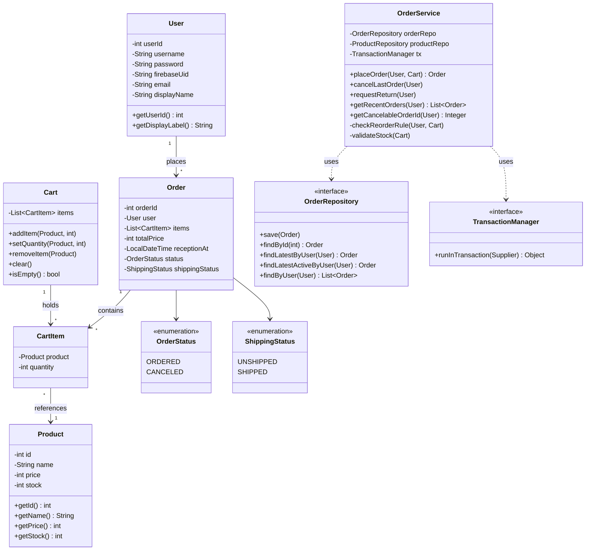
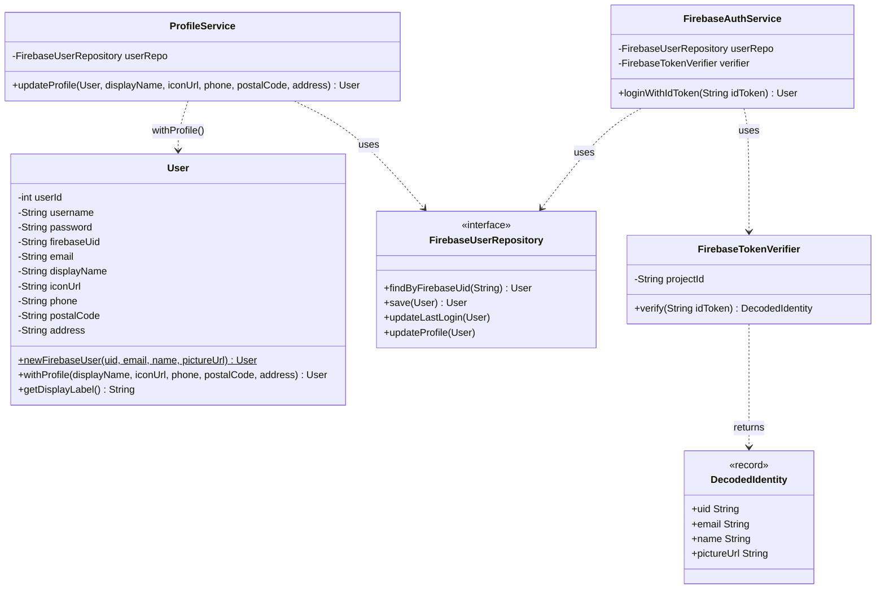
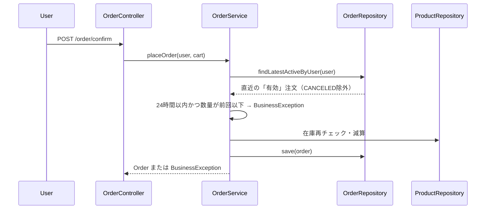
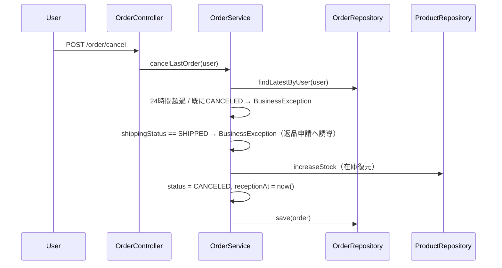

# EC-Lite 完成版仕様書 README v2.0

> v1.0（InMemory / Servlet・JSP）→ v2.0（JDBC永続化 / Cloud Run）→ 現行（Firebase Authentication移行・在庫復元・注文履歴機能）
> の3フェーズを経た最新版。旧README（v1.0）の構成を踏襲しつつ、差分を反映する。

---

## 1. 概要

EC-Lite は、Java による業務アプリケーション設計力・実装力を示すことを目的とした、
**最小構成のECサイト（教育・ポートフォリオ用途）**である。

単なる画面作成に留まらず、

- ドメインモデル設計
- 業務ロジックの明確化
- UIとJavaの責務分離
- 永続化層・認証基盤の段階的な差し替え（InMemory → JDBC、独自認証 → Firebase Authentication）

を重視し、第三者に説明可能な仕様書として整理している。

本プロジェクトは学習用ではあるが、**設計判断・業務ルールは実務基準**で検討・確定している。フレームワーク（Spring Boot / Maven / Gradle）に頼らず素のServlet/JSPで構築することで、フレームワークが裏側で肩代わりしている責務（DI、ライフサイクル管理、View解決等）を自分の手で設計・実装し、理解した上でフレームワークと比較できる状態を目指した。

---

## 2. 想定利用シーン

- Java案件獲得時の技術力証明
- 業務ロジック設計サンプル
- フレームワーク非依存な設計の提示
- 認証基盤・永続化層を段階的に差し替える設計力の提示（Repository実装差し替え、認証方式の並行運用）

---

## 3. 技術スタック

- Java：**JDK 25（LTS）で記述、`--release 24` でコンパイルしTomcat実行環境（JDK 24）に適合**
- UI：HTML / CSS
- View：JSP（JSTL 3.0）
- 実行形態：**コンソール版（`ec.app.Main`）＋ Web版（Servlet / JSP）の2形態を同一Service層で共有**
- 永続化：**Neon（無料枠PostgreSQL、`ap-southeast-1`）＋ JDBC（HikariCPコネクションプーリング）**。InMemory実装はテスト・学習用途として並行維持
- 認証：**Web版はFirebase Authentication（compat SDK, CDN経由・ビルドチェーン不要）／コンソール版はInMemory username/password認証のまま維持**（意図的な二本立て。詳細は§10.4）
- テスト：JUnit 5（JUnit Platform Console Standalone、Maven非依存）
- デプロイ：**Google Cloud Run（`asia-southeast1`）、Docker**
- テスト実行はローカル・Web版もローカルTomcat + Neon（本番DB）のハイブリッド構成で日常的に検証

※ Spring Boot 等のフレームワークは比較対象として理解した上で、初期実装では使用しない。

---

## 4. システム構成概要

- 買い物客向けUI（商品一覧・カート・注文完了・ログイン・プロフィール・注文履歴）
- Javaバックエンド（Service / Domain中心、Repositoryパターンで永続化層を抽象化）
- コンソール版とWeb版が同一のService層・Repository層を共有する二重エントリーポイント構成
- 認証はWeb版（Firebase）／コンソール版（InMemory）で完全に分離した二重構成
- 永続化はInMemory実装／JDBC実装をRepositoryインターフェース経由で差し替え可能な構成

---

## 5. 基本機能一覧

- ログイン／ログアウト（Web版：Firebase／コンソール版：InMemory認証）
- プロフィール編集（Web版）
- 商品一覧表示
- カート追加・数量変更・削除
- 注文確定
- 再注文制御
- キャンセル制御（在庫復元・発送ステータス連動）
- 直近注文サマリー表示（カート画面）・注文履歴表示（独立画面）
- 返品申請（ダミー実装、将来拡張の入口として用意）

---

## 6. 前提・制約

- 本仕様は学習・実力証明用途を目的とする
- 実運用を想定した決済・個人情報管理は対象外
- 商品・注文データはNeon（PostgreSQL）で永続化。InMemory実装はJUnitテスト・アルゴリズム検証用途として引き続き維持している
- コンソール版はWeb版の認証基盤（Firebase）とは独立し、InMemoryユーザーデータで動作する（アプリ再起動でリセット）

---

## 7. 用語定義

- **受付時刻（receptionAt）**：注文・キャンセル受付時点の基準時刻。注文またはキャンセルをシステムが受付けた最終時刻を表し、両者の区別は行わない
- **再注文**：同一ユーザーが同一商品を再度注文する行為
- **発送ステータス（shippingStatus）**：注文の発送状態を表す。`UNSHIPPED`（未発送）／`SHIPPED`（発送済み）の2値。現段階では業者側の発送処理フェーズが未実装のため、全注文が`UNSHIPPED`で固定運用されている
- **有効注文**：`OrderStatus`が`CANCELED`でない注文。再注文制御の基準として使われる（§12.3参照）

---

## 8. ドメインモデル・クラス設計

### 8.1 クラス図（Order集約まわり・現行版）



### 8.1.1 クラス図（Firebase認証・プロフィールまわり）

`User`は不変（immutable）設計で、値の変更は全て`with〜`系メソッドが新しいインスタンスを返す形で行う。



`FirebaseAuthService`は**ログインのみ**を担当し（`loginWithIdToken`：既存ユーザーなら`updateLastLogin`、新規なら`User.newFirebaseUser`で生成し`save`）、プロフィール編集は`ProfileService`に完全に分離している。これは責務分離の設計判断であり、統合はしない（§10.4）。

### 8.2 データ構造（Order）

| フィールド      | 型              | 備考                                  |
| --------------- | --------------- | ------------------------------------- |
| orderId         | int             |                                        |
| user            | User            |                                        |
| items           | List\<CartItem> | 確定時点の商品スナップショット        |
| totalPrice      | int             |                                        |
| receptionAt     | LocalDateTime   | 注文・キャンセル共通の最終受付時刻    |
| status          | OrderStatus     | ORDERED / CANCELED                    |
| shippingStatus  | ShippingStatus  | UNSHIPPED / SHIPPED（現状固定運用）   |

`User`は`username/password`（コンソール専用）と`firebaseUid/email/displayName/iconUrl/phone/postalCode/address`（Web専用、プロフィール項目含む）を同一クラスに共存させる二刀流構成。両者を統合せず、コンソール版・Web版それぞれの認証方式に必要なフィールドだけを使う設計とした（§10.4）。`phone`/`postalCode`/`address`は現状プロフィール編集画面での保持のみで、注文（`Order`）や配送処理とは未連携（§17の拡張候補）。

---

## 9. 画面仕様（UI）

### 9.1 基本方針

- 買い物客向け画面：ログイン／商品一覧表示／カート表示／注文確定／プロフィール編集／注文履歴確認
- 管理／補助機能：注文内容の確認、注文内容のメール送信（将来拡張）

### 9.2 UI構成詳細

- **ログイン画面**：Web版はFirebase（Googleログイン等）のポップアップ認証、コンソール版はユーザー名・パスワード入力
- **プロフィール画面**：Firebaseユーザーの表示名・アイコンURL・電話番号・郵便番号・住所を編集（Web版のみ）。`ProfileService.updateProfile`が表示名必須のバリデーションを行い、`User.withProfile`で新しいインスタンスを生成する不変（immutable）更新方式
- **商品一覧画面**：健康サプリを想定したダミー商品を3×3グリッドで表示。ヘッダーにログイン状態（`displayLabel`／ログアウトリンク、または未ログイン時はログインリンク）を表示
- **カート画面**：商品名／単価／数量／小計を表形式で表示。合計金額および注文確定操作。数量変更・削除に対応。**直近注文（24時間以内）の1行サマリーを表示し、キャンセル・返品申請ボタンを配置**（§12.6）。返品申請ボタンは`shippingStatus == SHIPPED`のときのみ活性化する
- **注文履歴画面**（`/orders/history`）：直近24時間以内の全注文を一覧表示。キャンセル可能な注文（直近1件のみ）にキャンセルボタンを活性化。返品申請ボタンは行ごとに`shippingStatus == SHIPPED`のときのみ活性化。エラーメッセージ表示欄あり（キャンセル・返品申請失敗時に使用）。ログイン時のヘッダー（商品一覧・カート画面）に「注文履歴」リンクを設置し、そこから遷移する
- **注文完了画面**：注文完了メッセージ・注文番号・受付時刻を表示。商品一覧への導線を提供

### 9.3 UI設計方針

- HTML/CSSのみで構成しJavaと接合しやすい構造
- UIは業務ロジックを持たず表示責務に限定
- モックHTML（`webapp/static/`）はJSP化前のスナップショットとして保持し、CSS・レイアウトの一致をdiffで証明可能にしている
- 新規画面（プロフィール、注文履歴）も既存のCSS変数規約（`--main-color`, `--border-color`, `--bg-color`）に準拠
- 商品画像は`webapp/images/`配下に商品IDベースの命名規則（`01_MultiVitamin.webp`等）で配置し、`productList.jsp`側の対応表で紐付け。`Product`モデルへの画像URLフィールド追加は行わず、View層に閉じた対応として実装（旧README「商品画像は仮のプレースホルダー表示のまま」から更新）
- 商品一覧の在庫表示は「在庫あり／残りわずか（閾値3固定）／在庫切れ」の3段階。在庫切れ時は数量入力・追加ボタンを無効化（§12.7参照）

---

## 10. UIとJavaの接合方針

### 10.1 View技術の選定

**JSP（JSTL）**を採用。フレームワーク非依存で、Servlet / Spring MVC いずれにも接合可能。

### 10.2 接合イメージ

- Java側で `List<Product>` や `Cart` を生成
- request / session attribute として View に渡す
- JSPではループ処理・条件分岐のみを行う

### 10.3 状態共有の設計

`AppInitializer`（`ServletContextListener`）でアプリ起動時に1度だけRepository・Serviceを生成し、`ServletContext` 属性として全Servletに共有する構成（`productRepo` / `authService` / `orderService` 等）。永続化実装（InMemory / JDBC）の選択は起動時の設定（後述の`-D`フラグ）で切り替わる。

### 10.4 認証方式の二重構成（Firebase移行で確定した設計判断）

- **コンソール版**：既存の`AuthService` + InMemory `UserRepository`（`username/password`）をそのまま維持
- **Web版**：`FirebaseAuthService`（ログイン専業）+ `ProfileService`（プロフィール編集専業）+ `FirebaseUserRepository`（InMemory/JDBC両対応）+ `FirebaseTokenVerifier`（RS256/JWKS検証）に切り替え
  - `FirebaseAuthService.loginWithIdToken(idToken)`：IDトークンを検証し、既存ユーザーなら`updateLastLogin`、未登録なら`User.newFirebaseUser(...)`で新規作成して`save`
  - `ProfileService.updateProfile(...)`：表示名必須バリデーション後、`User.withProfile(...)`で新インスタンスを生成し`updateProfile`で永続化。**ログイン処理とは完全に別クラスに分離**しており、`FirebaseAuthService`はプロフィール編集の責務を一切持たない
  - `FirebaseTokenVerifier`：`com.nimbusds`（nimbus-jose-jwt）でRS256/JWKS検証。GoogleのJWKSエンドポイントから鍵を取得し、`iss`/`aud`/`exp`は`DefaultJWTClaimsVerifier`で自動検証、`sub`（UID形式）と`auth_time`（5秒のクロックスキュー許容）は手動検証を追加
- 両者は**統合しない**。`User`クラスは不変（immutable）設計で、`username/password`系フィールドと`firebaseUid`系フィールド（プロフィール項目含む）を同一クラスに共存させ、`with〜`系メソッドで新インスタンスを生成する形に統一している
- Firebase compat SDK（CDN経由）を採用し、ビルドチェーンなしでWeb版に組み込んだ
- ログイン成功後はJSON応答を返すServlet設計に統一（`fetch`側の成否判定をHTMLフォワードに依存させない）

---

## 11. シーケンス図

### 11.1 注文確定〜再注文制御（現行版）



### 11.2 キャンセル〜在庫復元・発送ステータス分岐（現行版）



キャンセルされた注文は`findLatestActiveByUser`の対象から除外されるため、以降の再注文制御はそのキャンセル注文を無視し、さらに前の有効注文（無ければ無条件）を基準にする。

---

## 12. 業務ロジック仕様

### 12.1 カート追加・変更・削除

- 商品が存在しない場合はエラー
- 数量が1未満の場合はエラー
- 同一商品は数量加算（`Cart.addItem`）
- カート画面での数量変更・削除は `CartServlet`（`/cart/update`, `/cart/remove`）経由で `Cart.setQuantity` / `Cart.removeItem` を呼び出す（Web版・コンソール版とも対応済み）

### 12.2 注文確定

`OrderService.placeOrder(User, Cart)` は`TransactionManager`によるトランザクション境界の中で以下の5ステップを実行する。

1. カート空チェック
2. 再注文制御判定（`checkReorderRule`）
3. 在庫再チェック（全商品、一括確認してから先に進む）
4. Order生成・在庫減算・保存
5. カートクリア

### 12.3 再注文制御ルール（★更新：判定基準を「直近の有効注文」に変更）

- 同一ユーザー × 同一商品
- 判定基準は**直近24時間以内に受付けられた、直近の「有効な」（`CANCELED`でない）注文**における当該商品の数量（`OrderRepository.findLatestActiveByUser`）
- **再注文数量が基準注文時の数量より多い場合のみ許可**。同等以下はエラー
- 24時間より前の履歴しかない場合、有効注文が存在しない場合（初回注文、または直近注文がキャンセル済みで他に有効注文がない場合）はルール適用対象外
- キャンセル済みの注文は基準から完全に除外されるため、キャンセル直後は同数量・それ以下でも再注文が可能になる

### 12.4 キャンセル仕様（★更新：在庫復元・発送ステータス分岐を追加）

- システム上でキャンセル可能なのは、直近24時間以内に受付けられた最後の注文1件のみ
- 既にキャンセル済みの注文は再キャンセル不可
- **発送済み（`shippingStatus == SHIPPED`）の注文はキャンセル不可**。返品申請への誘導メッセージを表示する
- **キャンセルが成立した場合、対象注文の全商品について在庫を復元する**（旧仕様「在庫は戻さない」から変更）
- キャンセルが成立した場合でも、注文数量は最終値として履歴に保持する
- キャンセル受付時刻は `receptionAt` を上書きし、以降の再注文制御（24時間判定・基準注文の選定）の双方に影響する
- それ以前の注文については、販売業者への連絡対応とする（本システムの対象外）

### 12.5 返品申請（ダミー実装）

- `OrderService.requestReturn(User)` として入口のみ用意
- 対象となる発送済み注文が無ければエラー
- **キャンセル済み（`status == CANCELED`）の注文は、`shippingStatus`の値によらず返品申請の対象外**とする（現行の業務フローではキャンセル済み注文が発送済みになることは無いはずだが、将来の発送ステータス本格運用に備えた防御的チェックとして追加）
- 発送済み注文があっても、現段階では「準備中です」で処理を止める
- 発送ステータスが実運用で可変になった際（業者側フェーズ実装後）の接続先として、あらかじめメソッド・呼び出し経路のみ確保している
- Web版：`/order/return`（`OrderReturnServlet`）が窓口。カート画面・注文履歴画面どちらからも呼び出し可能で、隠しフィールド`returnTo`で戻り先（`cart`/`history`）を判定する
- 画面上のボタンは`shippingStatus == SHIPPED`の場合のみ活性化（カート画面・注文履歴画面とも）。現状は全注文が`UNSHIPPED`固定のため、実質常に非活性表示のままとなる

### 12.6 直近注文サマリー・注文履歴表示

- `OrderService.getRecentOrders(User)`：直近24時間以内の注文をキャンセル済みも含めて受付時刻の新しい順に返す
- `OrderService.getCancelableOrderId(User)`：履歴上でキャンセルボタンを活性化してよい注文ID（存在すれば直近1件のみ、無ければ`null`）を返す
- **カート画面**：`getRecentOrders`の先頭（最新）1件のみを1行サマリーとして表示。キャンセルボタンは`getCancelableOrderId`と一致する場合のみ活性化
- **注文履歴画面（`/orders/history`）**：`getRecentOrders`の全件を表形式で表示。カート画面と同じキャンセル可否判定を適用。将来的な拡張（返品申請中ステータスの表示等）の受け皿として独立ページのまま維持する

### 12.7 在庫表示（商品一覧）

- 在庫数に応じて3段階で表示を切り替える：**在庫あり**（`stock > 3`）／**残りわずか（あとN点）**（`0 < stock <= 3`）／**在庫切れ**（`stock <= 0`）
- 閾値`3`は現状`productList.jsp`側にハードコードした固定値。業者ごとの設定可能化・閾値到達時の在庫補填メール通知は将来拡張（§17）
- 在庫切れ商品はカート追加フォームの数量入力・追加ボタンをdisabledにする（UI上の防御）。ただし実際の在庫チェックは従来通り`OrderService.validateStock`が注文確定時に必ず行うため、disabled表示はあくまで補助でありサーバー側の検証を代替するものではない

---

## 13. エラーハンドリング

| ケース                                             | 発生箇所                                  |
| --------------------------------------------------- | ------------------------------------------ |
| 商品未存在                                          | カート追加時 / 注文確定時の在庫チェック時 |
| 数量不正（1未満）                                    | カート追加時                              |
| カート空                                             | 注文確定時                                |
| 在庫不足                                             | 注文確定時                                |
| 再注文数量違反（同等以下、直近有効注文基準）           | 注文確定時                                |
| キャンセル不可（期限超過／対象なし／再キャンセル）      | キャンセル操作時                          |
| **キャンセル不可（発送済み）**                        | キャンセル操作時                          |
| **返品申請対象なし／準備中**                          | 返品申請操作時                            |
| ログイン認証失敗（Firebase / InMemory 双方）           | ログイン時                                |
| 未ログイン状態での注文確定                            | 注文確定時（ログイン画面へリダイレクト）  |
| **認証トークン検証失敗**                              | Firebaseログイン時（`FirebaseTokenVerifier`） |

すべて `BusinessException`（`RuntimeException` のサブクラス）として送出し、Controller層（`OrderController` 等）が `catch` してエラーメッセージをJSPへ受け渡す設計に統一している。認証トークン検証エラーは詳細を露出させない汎用メッセージとして返す（原因調査は開発時のみ一時的なデバッグ出力で対応し、本番コードには残さない）。

---

## 14. テスト

### 14.1 テスト構成

JUnit 5（JUnit Platform Console Standalone、Maven非依存）を使用。`test/ec/repository/InMemoryOrderRepositoryTest.java` と `test/ec/service/OrderServiceTest.java` の2ファイルで、正常系・異常系・境界値をあわせて**35件**のテストケースを実装（v1.0時点24件から、在庫復元・発送ステータス分岐・`findLatestActiveByUser`のカバレッジを追加）。

### 14.2 テスト観点（追加分）

- キャンセル時の在庫復元（単一商品・複数商品）
- 発送済み注文のキャンセル拒否
- キャンセル後は同数量・それ以下でも再注文可能（基準除外の確認）
- 返品申請の異常系（対象なし／未発送のみ／発送済みで準備中メッセージ）
- `findLatestActiveByUser`のCANCELED除外パターン全般（最新がCANCELEDでもその前の有効注文を返す境界含む）

### 14.3 実行結果（最新）

```
[        35 tests found           ]
[        35 tests successful      ]
[         0 tests failed          ]
```

InMemory実装を対象としたユニットテストであり、JDBC実装（`JdbcOrderRepository`等）の動作確認は別途Neon上での手動確認で担保している（§15参照）。

---

## 15. 実行方法

### 15.1 Web版（標準デプロイ手順）

Portable Tomcat環境特有の落とし穴（JVM起動プロセスの実体不一致、webappディレクトリの非同期、シェル構文差異）を踏まえ、以下の手順に統一している。

```powershell
# 1. コンパイル（PowerShell）
javac -cp "lib/*" --release 24 -d webapp/WEB-INF/classes `
  (Get-ChildItem -Recurse -Filter "*.java" -Path src | ForEach-Object { $_.FullName })

# 2. Tomcatの実デプロイ先へ同期（webappとwebapps/ec-liteは別ディレクトリのため必須）
robocopy "webapp" "<CATALINA_HOME>\webapps\ec-lite" /MIR

# 3. 既存プロセスを止めてから起動（多重起動によるポート衝突防止）
netstat -ano | findstr :8888
Stop-Process -Id <PID> -Force
```

```cmd
:: 4. Tomcat起動（cmdから、必ずこの経路で。IDEのServersパネル経由は使わない）
cd /d <CATALINA_HOME>\bin
set CATALINA_HOME=<CATALINA_HOME>
set CATALINA_BASE=<CATALINA_HOME>
startup.bat
```

`-D`フラグ（DB接続情報・Firebase projectId等）は`<CATALINA_HOME>\bin\setenv.bat`の`CATALINA_OPTS`経由で渡す（RSP経由の起動では反映されないため、Tomcat標準機構を使う）。

```
http://localhost:8888/ec-lite/products
```

Web版ログインはFirebase Authentication（Googleログイン等）。初回ログイン用のInMemoryユーザーは廃止済み（コンソール版のみ`alice` / `password`が有効）。

### 15.2 コンソール版

```bash
javac -cp "lib/*" --release 24 -d console-classes $(find src -name "*.java")
java -cp console-classes ec.app.Main
```

InMemory `username/password` 認証のまま。対話式メニューでログイン・商品一覧・カート操作・注文確定・キャンセルを一通り確認できる。

### 15.3 テスト実行

```bash
javac -cp "lib/*" --release 24 -d test-classes $(find src -name "*.java") $(find test -name "*.java")
java -jar lib/junit-platform-console-standalone-1.10.0.jar execute --class-path test-classes --scan-class-path --details=tree
```

---

## 16. セキュリティについて

- **Web版はFirebase Authenticationを導入済み**（旧README「将来的に利用予定」から更新）。トークン検証は`FirebaseTokenVerifier`（RS256/JWKS、`auth_time`/`sub`検証、5秒のクロックスキュー許容）で行う
- **コンソール版は引き続きInMemory username/password認証**（学習目的でパスワード平文管理を維持。ハッシュ化は将来対応）
- 認証トークン検証エラーは詳細を画面に露出させない設計（原因調査時のみ一時的なデバッグ出力を使い、確認後は必ず戻す運用ルールとした）
- Neon（PostgreSQL）接続情報・Firebase projectId等の機密情報は`-D`フラグ経由でアプリ起動時に注入し、ソースコードにハードコードしない

---

## 17. 今後の拡張

- 発送ステータスの本格運用（業者側フェーズ：`UNSHIPPED`→`SHIPPED`の実際の遷移契機の実装）
  - ⚠️ **実装時の必須ガード**：現行の`cancelLastOrder`（`SHIPPED`はキャンセル不可）と`requestReturn`（`CANCELED`は返品申請不可）は、互いに反対方向から「キャンセル済みかつ発送済み」という状態の発生を防ぐ二重ガードになっている。発送済みへの遷移処理（業者側の発送確定操作）を新規実装する際は、**必ず対象注文が`status == CANCELED`でないことを確認してから`shippingStatus`を更新すること**。このガードを入れ忘れると、上記2つの防御をすり抜けて「キャンセル済みなのに発送済み」という業務上あり得ない状態を作れてしまう
  - 現状`JdbcOrderRepository.updateExistingOrder`は`reception_at`/`status`のみを更新しており、`shipping_status`を書き換えるUPDATE経路はDB層にまだ存在しない（新規追加が必要）
- 返品申請フローのフル実装（UI・導線（`/order/return`、活性化条件）は実装済み。`OrderService.requestReturn`自体は「準備中」を返すダミーのままで、実際の返品受付処理は業者側フェーズ実装後の対応）
- **「残りわずか」閾値の業者設定化**：現状は商品一覧JSPに固定値（`3`）としてハードコードしている表示ロジックを、`Product`に閾値項目（例：`lowStockThreshold`）を追加した上で業者向け管理画面から設定可能にする。あわせて、閾値を下回った時点で業者へ在庫補填を促すメール通知（メール送信基盤の新設が前提）を`OrderService`または新設の在庫監視Serviceから送る導線を追加する
- Web化の深化（Spring Boot移行）：Service層・Repository層はそのまま流用可能
- Neon本番データの初期在庫値見直し（テスト用の少数値から実運用相当の値へ）

---

## 18. 完成宣言

本 README に記載された仕様と、実装・テスト・両エントリーポイント（Web / コンソール）での動作確認をもって、
**EC-Lite 現行版（Firebase移行・在庫復元・注文履歴機能・返品申請導線を含む）は完成版として確定する。**

- ✅ ドメインモデル・Repository（InMemory / JDBC）・Service層の実装完了
- ✅ JUnit 35件全成功（InMemory実装対象）
- ✅ Web版（Firebaseログイン・商品一覧・カート・注文確定・キャンセル・在庫復元・注文履歴・返品申請導線・ログアウト）Cloud Run本番環境での動作確認済み
- ✅ コンソール版（InMemory認証・同一Service層を共有、デバッグ用メニュー含む）動作確認済み
- ❌ Neon本番データの初期在庫値見直し（テスト用の少数値から実運用相当の値へ）は未実施

本仕様は、Javaによる業務アプリケーション設計力・業務ロジック設計力に加え、認証基盤・永続化層の段階的な差し替え設計力を第三者に説明・提出可能な水準である。

---

## 19. ライセンス

本プロジェクトは**GNU General Public License（GPL）**のもとで公開する。

---

*EC-Lite 完成版仕様書 README v2.0 — Firebase移行・注文履歴機能反映版*
